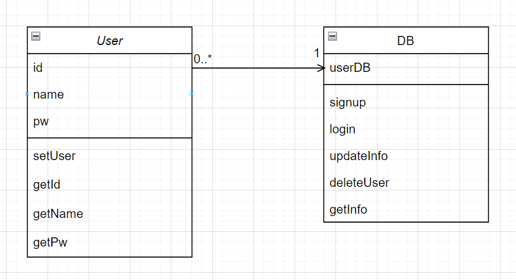

회원 서비스
---

## 실행 방법

1. MemberService 실행
2. 1~6번의 메뉴 입력 후 진행
3. 0을 누르면 종료

## 기능

### 1. 회원가입

- 설명
    - 아이디, 이름, 비밀번호를 입력받아 회원가입 합니다.
- 방법
    - 아이디 입력
    - 이름 입력
    - 비밀번호 입력

- 예외 사항
    - 로그인 상태일 경우 실패
    - 아이디가 존재할 경우 실패

### 2. 로그인

- 설명
    - 아이디, 비밀번호로 로그인합니다.

- 방법
    - 아이디 입력
    - 비밀번호 입력

- 예외 사항
    - 로그인 상태일 경우 실패
    - 아이디가 존재하지 않을 경우 로그인 실패
    - 비밀번호가 일치하지 않을 경우 로그인 실패

### 3. 회원 정보 수정

- 설명
    - 현재 유저의 이름, 비밀번호를 변경합니다.
- 방법
    - 수정할 이름 입력
    - 수정할 비밀번호 입력

- 예외 사항
    - 로그아웃 상태일 경우 실패

### 4. 탈퇴

- 설명
    - 현재 유저를 로그아웃 합니다.
- 예외 사항
    - 로그아웃 상태일 경우 실패

### 5. 로그아웃

- 설명
    - 현재 유저를 로그아웃합니다.
- 예외 사항
    - 로그아웃 상태일 경우 실패

### 6. 회원 정보 확인

- 설명
    - 현재 회원의 아이디, 이름을 출력합니다.
- 예외 사항
    - 로그아웃 상태일 경우 실패

## 클래스 다이어그램

